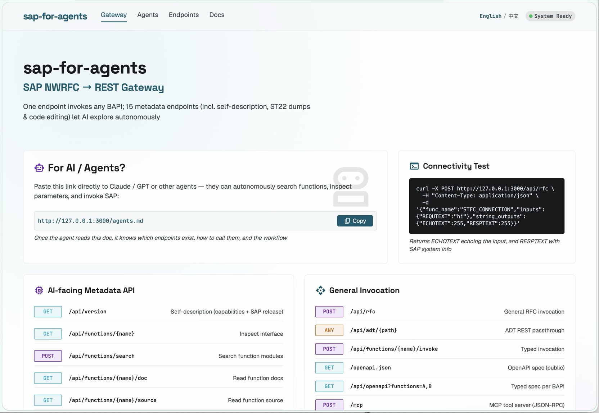

# sap-for-agents

[English](./README.md) | [简体中文](./README.zh-CN.md)

Wraps the SAP NWRFC SDK into a long-running HTTP service that exposes any SAP RFC / BAPI through a RESTful interface. Other services can invoke SAP without installing the SDK — a single JSON POST does the job.

- **Stack**: Rust (standard-library FFI linking directly to `sapnwrfc.dll`) + axum + tokio + serde
- **Zero-SDK clients**: callers only need to send an HTTP POST
- **Generic interface**: one endpoint, `/api/rfc`, describes any BAPI — no per-BAPI glue code
- **AI-friendly**: 16 metadata endpoints (self-description / search functions / inspect interfaces / read docs / view source / read transparent tables / query the data dictionary / triage short dumps / **edit ABAP code**) let agents explore and act self-service. The operator guide for AI lives in [`AGENTS.md`](./AGENTS.md)



> ⚠️ **Risk disclaimer**: this is an **exploratory, experimental project**, primarily built for learning, testing, and local development scenarios. It has not been hardened for production use, offers no guarantee of stability or correctness, and its APIs may change at any time. It grants RFC access with the full privileges of the configured `SAP_USER` — before using it, you must evaluate the risks yourself (data exposure, unauthorized calls, compliance, etc.) and take your own precautions. Use it against production SAP systems at your own risk; the authors accept no liability for any loss arising from its use.

## Table of Contents

- [Quick Start](#quick-start)
- [§1 Use Cases and Limitations](#1-use-cases-and-limitations)
- [§2 Configuration Reference](#2-configuration-reference)
- [§3 API Reference](#3-api-reference) — incl. [3.3 AI-facing Metadata API](#33-ai-facing-metadata-api)
- [§4 Call Examples](#4-call-examples)
- [§5 Common BAPI Quick Reference](#5-common-bapi-quick-reference)
- [§6 Error Handling](#6-error-handling)
- [§7 Deployment Tips](#7-deployment-tips)
- [§8 Architecture and Limitations](#8-architecture-and-limitations)
- [§9 Server Mode (Called by SAP)](#9-server-mode-called-by-sap) — see [docs/SERVER_MODE.md](./docs/SERVER_MODE.md)
- [§10 Releasing a New Version (Maintainers)](#10-releasing-a-new-version-maintainers)
- [License](#license)

---

## Quick Start

> **You need both of the following:**
> 1. **Prebuilt binary / Rust source**: provides the HTTP service and the SAP protocol binding code
> 2. **SAP NWRFC SDK**: SAP's proprietary C library that provides the actual SAP communication implementation (cannot be redistributed with this project due to licensing)
>
> A prebuilt binary saves you from installing the Rust toolchain and a ~23-second compile, but it does **not** save you from the SDK — the SAP library is still linked at runtime.
>
> 📦 **The easy way**: drop the **matching-platform** zip you downloaded from SAP (e.g. `nwrfcsdk-...-darwin-arm64.zip` on macOS, `...-linux-x86_64.zip` on Linux) into any subdirectory under `nwrfcsdk/lib/`. The startup script auto-extracts it to the correct `<os>-<arch>/` path. See "Auto-install the SDK" below.
>
> ⚠️ The zip must match your current platform (`.dylib`↔macOS, `.so`↔Linux, `.dll`↔Windows). The script does not validate the platform; placing a zip for the wrong platform leaves library files that cannot be loaded after extraction.

### Auto-install the SDK (recommended)

`start.sh` / `start.ps1` look for the SDK in this order:

1. **Environment variable `SAP_SDK_DIR`** — points to an already-installed SDK root (most flexible; common for Docker/CI)
2. **`nwrfcsdk/lib/<os>-<arch>/`** — the default path with library files already in place
3. **`nwrfcsdk/lib/<any>/nwrfcsdk-*.zip`** — auto-detected and extracted to the correct path ✨
4. None found → errors out with clear guidance

Easiest: drop the whole **matching-platform** zip you downloaded from SAP into any subdirectory under `nwrfcsdk/lib/` and let the startup script handle it. Example (macOS Apple Silicon):

```
nwrfcsdk/
└── lib/
    └── incoming/                  ← create any directory
        └── nwrfcsdk-...-darwin-arm64.zip   ← must be the SDK for the current platform
```

Then run `./start.sh`. The script automatically:

- Extracts the zip
- Locates the library files inside the zip (SAP SDK zips are typically `nwrfcsdk/lib/<file>` with no platform subdirectory)
- Copies them to `nwrfcsdk/lib/darwin-aarch64/` (or the corresponding platform subdirectory)
- Cleans up temporary files

After extraction the real path still follows SAP's official layout, which makes future SDK updates easier.

### Download a prebuilt binary (recommended for end users)

Skip Rust; use a ready-made binary:

1. Open [GitHub Releases](../../releases) → pick the latest tag
2. Download the archive for your platform:
   - Linux x86_64: `sap-for-agents-x86_64-unknown-linux-gnu.tar.gz`
   - Linux ARM64: `sap-for-agents-aarch64-unknown-linux-gnu.tar.gz`
   - macOS Intel: `sap-for-agents-x86_64-apple-darwin.tar.gz`
   - macOS Apple Silicon: `sap-for-agents-aarch64-apple-darwin.tar.gz`
   - Windows x86_64: `sap-for-agents-x86_64-pc-windows-msvc.zip`
3. Extract it; inside you'll find `sap_for_agents` (or `.exe`) + `README.md` + `.env.example` + the `nwrfcsdk/` directory skeleton
4. **Download the SAP NWRFC SDK**: register an account on the [SAP Support Portal](https://launchpad.support.sap.com) (requires SAP customer/partner status), search for `SAP NW RFC SDK`, and download the zip for your platform
5. **Place the zip into any subdirectory under `nwrfcsdk/lib/`** (e.g. `nwrfcsdk/lib/incoming/`); the startup script auto-extracts it to the correct `<os>-<arch>/` path. **The zip must match your current platform** (macOS→`.dylib`, Linux→`.so`, Windows→`.dll`)
6. `cp .env.example .env` and fill in the SAP connection parameters
7. Run:
   - Linux/macOS: `./sap_for_agents`
   - Windows: double-click `sap_for_agents.exe` or launch it from PowerShell

> **Windows users**: CI now builds a Windows x86_64 binary automatically (a `.def` file generates a stub import library to work around the MSVC linking restriction). After extracting the zip you still need to place `sapnwrfc.dll` yourself; see steps 4–5.

### Option 1: Run locally (development/debugging)

```bash
# 1. Install Rust (skip if already installed)
#    Windows: winget install Rustlang.Rustup
#    Linux/macOS: curl --proto '=https' --tlsv1.2 -sSf https://sh.rustup.rs | sh

# 2. Place the SAP SDK (matching platform subdirectory; see nwrfcsdk/README.md)
#    Windows: nwrfcsdk/lib/windows-x86_64/   ← place sapnwrfc.dll, etc.
#    Linux:   nwrfcsdk/lib/linux-x86_64/     ← place libsapnwrfc.so, etc.

# 3. Configure connection settings
cp .env.example .env        # then edit .env and fill in SAP connection params

# 4. One-shot environment check and launch (start.ps1 on Windows, start.sh on Linux/macOS)
./start.sh                  # or: powershell -File start.ps1

# 5. Verify (in a new terminal)
curl http://127.0.0.1:3000/health
# → {"status":"ok"}
```

### Option 2: Docker (deployment)

```bash
# 1. Place the Linux SDK into nwrfcsdk/lib/linux-x86_64/ (needed at build time)

# 2. Copy and fill in the configuration
cp .env.example .env        # edit: fill in SAP connection params + SAP_SDK_HOST_PATH (below)

# 3. One-shot up (docker compose auto-builds + runs + mounts the SDK + injects config)
docker compose up -d --build

# 4. Verify
curl http://127.0.0.1:3000/health
```

Add one extra entry to `.env`: `SAP_SDK_HOST_PATH` — the **absolute path** of the Linux SDK directory on the host (e.g. `C:\Users\you\sap-sdk` or `/opt/sap/nwrfcsdk`). compose mounts it into the container at `/app/nwrfcsdk`. This directory's layout must match `nwrfcsdk/` (containing `lib/linux-x86_64/libsapnwrfc.so`).

### First call

Once the service is up, any HTTP client can call it:

```bash
curl -X POST http://127.0.0.1:3000/api/rfc \
  -H "Content-Type: application/json" \
  -d '{"func_name":"STFC_CONNECTION","inputs":{"REQUTEXT":"hello"},"string_outputs":{"ECHOTEXT":{"max_len":null}}}'
```

> Leave `max_len` as `null` — the service auto-discovers the field length from SAP metadata, so you don't have to fill it in by hand.


## 1. Use Cases and Limitations

**Good fit**

- Microservice architectures that let Python / Node / Java services call SAP over HTTP
- Automation scripts, ETL, reporting backends
- Local development and debugging of BAPIs

**Capability boundaries**

| Capability | Support |
|---|---|
| Connection | ✅ Direct connect (ASHOST), auto-reconnect, graceful shutdown |
| Scalar input | ✅ string/int/float auto-dispatched by JSON type; BCD/INT8/binary via explicit `{"type":"...","value":...}` |
| Scalar output | ✅ `int_outputs` (read as INT) / `string_outputs` (read as string, length auto-discoverable) / `auto_outputs` (read by the metadata's true type, preserving INT/FLOAT/INT8/binary semantics) |
| Table parameters (TABLES) | ✅ multi-row input + output traversal; fields with `"auto":true` are read by true type (INT/FLOAT/INT8/Base64), otherwise as string |
| Top-level structure parameters | ✅ `struct_inputs` / `struct_outputs` (e.g. BAPI_USER_CREATE.ADDRESS); output fields also support `auto` for true-type reading |
| BCD/INT8/binary input | ✅ `{"type":"BCD",...}` / `{"type":"INT8",...}` / `{"type":"BYTES",...}` (BYTES as Base64) |
| Metadata auto-discovery | ✅ field-length caching, no manual `max_len` needed (works for scalar/table/structure outputs) |
| Server mode (called back by SAP) | ✅ config-driven webhook forwarding (`SAP_ROLE=server`); see [§9](#9-server-mode-called-by-sap) |
| tRFC/qRFC/bgRFC | ❌ Not supported |
| SSO/SNC secure logon | ❌ Username/password only |

**Other limitations**

| Item | Notes |
|---|---|
| Concurrency | Multi-connection pool (default 8, configurable via `SAP_POOL_SIZE`); SAP calls from different requests run in parallel; when the pool is exhausted, `acquire` waits up to 120s. Connections idle longer than `SAP_POOL_IDLE_VALIDATE_SECS` (default 30s) are `RFC_PING`-validated before reuse — zombie connections discarded by SAP-side restarts are caught at checkout instead of poisoning the first requests. Connection/create failures are retried by error code (up to 3 rounds with 300ms backoff; retries always use freshly created connections), making SAP warm-up windows (license check, half-ready CPIC) transparent to callers |
| Character set | Bridges SAP UC via UTF-16; UTF-8 input and output |
| Platforms | Windows/Linux/macOS × x86_64/aarch64 (`build.rs` auto-selects the SDK subdirectory) |
| RFC call timeout | The connection-pool layer has an acquire timeout (120s); a single RFC call has no execution timeout yet |

---


## 2. Configuration Reference

All configuration goes through environment variables, written to `.env` in the project root (gitignored, never committed). Quick Start covers the basics; this section is the full field reference.

| Variable | Required | Default | Description |
|---|:---:|---|---|
| `SAP_ASHOST` | ✅ | — | SAP application server hostname/IP |
| `SAP_SYSNR` | ✅ | — | System number, e.g. `00` |
| `SAP_CLIENT` | ✅ | — | Client number, e.g. `001` |
| `SAP_USER` | ✅ | — | Logon account |
| `SAP_PASSWD` | ✅ | — | Logon password |
| `SAP_LANG` | ❌ | `EN` | Logon language (also sets the default language for doc endpoints) |
| `SAP_LISTEN_ADDR` | ❌ | `127.0.0.1:3000` | HTTP service listen address |
| `SAP_POOL_SIZE` | ❌ | `8` | SAP connection pool cap (number of concurrent calls), ≥1 |
| `SAP_POOL_IDLE_VALIDATE_SECS` | ❌ | `30` | Idle-validate threshold in seconds: connections idle longer than this are `RFC_PING`-validated (zombie connections discarded and rebuilt) before being handed out, so the first requests after an idle period no longer hit `RFC_INVALID_HANDLE`. `0` disables validation. Background: connection death has nothing to do with SAP restarts — gateway idle-disconnect policies (`gw/conn_disconnect`, system-dependent), laptop sleep/wake, Docker/VM pause+resume, VPN reconnects and firewall/NAT idle timeouts all create **silent** half-open connections; the pool never gets notified |
| `SAP_READ_ONLY` | ❌ | _(off)_ | Read-only mode (`1`/`true`/`yes`/`on`): the gateway's own write endpoints — `/api/objects` `PUT source` and `POST replace`, plus non-read `/api/adt` methods — return `403 READ_ONLY`. `POST syntax` (nothing stored) and `POST /api/rfc` are unaffected (RFC calls cannot be reliably classified as read/write; SAP-side authorizations remain the real boundary) |
| `SAP_REQUEST_TIMEOUT_SECS` | ❌ | `60` | Global timeout in seconds for a single SAP call, ≥1; returns 504 on timeout. `/api/rfc` accepts a per-request `timeout_secs` in the body to override it |
| `SAP_RATE_LIMIT_RPS` | ❌ | _(no rate limit)_ | Requests per second per caller IP for `/api`; set ≥1 to enable; returns 429 when exceeded |
| `SAP_UPDATE_CHECK` | ❌ | _(on)_ | New-release check: at startup and every 24h the gateway makes one anonymous GET to `api.github.com` for this repo's latest release (no telemetry, no user data). Result surfaces in `/api/version` → `latest` and the web UI footer. Set `off`/`false`/`0`/`no` to disable (fully offline) |
| `SAP_ROLE` | ❌ | `client` | Run mode: `client`/`server`/`both` (server mode: see [§9](#9-server-mode-called-by-sap)) |
| `SAP_SDK_DIR` | ❌ | `./nwrfcsdk` | SDK root directory (for Docker/CI/custom paths) |

> **Production deployment tip**: do not bake `.env` into the image layer. Use your orchestration system's secret injection (K8s Secret / Docker Swarm secret) instead.

---


## 3. API Reference

### Authentication (optional)

Once `SAP_API_KEY` is set, every `/api/*` business endpoint requires the request header `Authorization: Bearer <token>`; without it the service is unauthenticated (the localhost default). The probes `/health`, `/ready`, `/api/version`, and the public pages `/`, `/agents.md` are always open.

```bash
# Enable authentication (generate a long random string)
export SAP_API_KEY=$(openssl rand -hex 32)

# Send the token when calling
curl -H "Authorization: Bearer $SAP_API_KEY" \
  http://127.0.0.1:3000/api/functions/BAPI_USER_GETLIST
```

> ⚠️ As soon as you expose the service to a network (`SAP_LISTEN_ADDR=0.0.0.0` or Docker deployment), **always** set `SAP_API_KEY`. Otherwise anyone who can reach the port can invoke any RFC with the privileges of `SAP_USER`. Failure returns `401 {"code":401,"message":"..."}` + `WWW-Authenticate: Bearer`.

### 3.1 Liveness and readiness probes

Two probe endpoints with distinct semantics:

#### `GET /health` — liveness (process alive)

Does not touch SAP; returns instantly; used to check whether the process is alive.

```json
{ "status": "ok", "version": "0.10.0" }
```

#### `GET /ready` — readiness (SAP reachable)

Borrows a connection from the pool and calls the SAP standard function `RFC_PING` (with a 5s timeout) to verify the backend is reachable.

- Success: `200 { "status": "ready", "sap": "ok" }`
- SAP unreachable / timeout: `503 { "status": "unavailable" | "timeout", ... }`

For orchestration systems (K8s, etc.): use `/health` as the livenessProbe (restart only when the process dies) and `/ready` as the readinessProbe (only shed traffic and wait for recovery when SAP is unreachable).

#### `GET /metrics` — Prometheus metrics (unauthenticated)

Returns Prometheus text-format metrics for Prometheus / Grafana and other scrapers:

- `pool_idle` / `pool_total` / `pool_max` — connection pool idle / total built / cap
- `rfc_calls_total{func,result}` — RFC call count (by function × success/failure)
- `rfc_call_duration_ms{func}` — call-duration histogram (with p50/p90/p99)

> Unauthenticated (an ops probe, like `/health` and `/ready`). On a public deployment, protect it at the reverse-proxy layer.

#### `GET /api/version` — version & capability self-description (public)

One call answers everything an agent would otherwise learn by hitting 401/403/503/429: gateway version + git commit (`-dirty` suffix when built with uncommitted changes), capability switches, and the target SAP system info.

```json
{
  "name": "sap-for-agents",
  "version": "0.10.0",
  "commit": "0fa6d6b",
  "capabilities": { "auth": false, "read_only": false, "adt": true, "rate_limit_rps": null },
  "latest": { "version": "0.11.0", "url": "https://github.com/Jack-Liang/sap-for-agents/releases/tag/v0.11.0", "update_available": true },
  "sap": { "sysid": "A4H", "release": "816", "host": "vhcala4h", "os": "Linux", "destination": "vhcala4hci_A4H_00", "client": "001" }
}
```

- Gateway-local fields (version/commit/capabilities) never touch SAP and never fail. The `sap` block is fetched lazily via `RFC_SYSTEM_INFO` on the first call and cached for the process lifetime; when SAP is unreachable it is `null` (with `sap_error`) and the endpoint still returns 200.
- `latest` comes from a background check against GitHub Releases (at startup and every 24h; one anonymous GET, no telemetry — disable with `SAP_UPDATE_CHECK=off`). It is `null` when not fetched yet, disabled, or unreachable; the web UI footer also shows an "update available" badge when a newer release exists.
- `sap.release` is the kernel/Basis level; it does not distinguish ECC from S/4HANA (check the `CVERS` table for `S4CORE` instead).
- Unauthenticated by design: an agent must be able to learn `capabilities.auth` (whether a token is needed) before holding one. On a public deployment, protect it at the reverse-proxy layer if the SAP hostnames it exposes are sensitive.

---

### 3.2 `POST /api/rfc`

Generic RFC invocation. The request body describes which function to call, what parameters to pass, and which outputs to read.

#### Request body fields

| Field | Type | Required | Description |
|---|---|:---:|---|
| `func_name` | string | ✅ | SAP function module name, e.g. `BAPI_USER_GETLIST` |
| `inputs` | object | ❌ | Scalar input parameters: parameter name → value (implicit: string→CHARS, integer→INT, float→FLOAT) |
| `table_inputs` | object | ❌ | Table input parameters: table name → array of rows; each row is field name → value |
| `struct_inputs` | object | ❌ | Top-level structure input: structure name → {field name → value} (e.g. `ADDRESS`) |
| `int_outputs` | string[] | ❌ | Names of integer output parameters to read (read as SAP `INT`) |
| `string_outputs` | object | ❌ | String output parameters to read: parameter name → max length. When `max_len` is `null`, the server auto-discovers it from metadata |
| `auto_outputs` | string[] | ❌ | Names of scalar output parameters to read by the metadata's true type (INT→integer, FLOAT→float, INT8→i64, BCD→string, BYTE/XSTRING→Base64) |
| `table_outputs` | object | ❌ | Output tables to read: table name → array of field objects `{"name":"...","max_len":...,"auto":...}` (when `auto:true`, read by true type; default false) |
| `struct_outputs` | object | ❌ | Top-level structure outputs to read: structure name → array of field objects (same field rules as `table_outputs`) |
| `read_return` | bool | ❌ | Whether to auto-read the BAPI `RETURN` message table; default `false` |
| `timeout_secs` | u64? | ❌ | Per-call timeout in seconds (takes effect when ≥1); if omitted/0, uses the global `SAP_REQUEST_TIMEOUT_SECS` (default 60s); returns 504 on timeout. Raise it for slow endpoints (batch BAPIs, large-table queries) |

**Value-type rules** (field values of `inputs` / `table_inputs` / `struct_inputs`):

- JSON string → SAP `CHARS` (e.g. `"X"`, `"D*"`)
- JSON integer → SAP `INT` (e.g. `50`)
- JSON float → SAP `FLOAT` (e.g. `123.45`)
- Explicit type (for BCD/INT8/binary): `{"type":"BCD","value":"999.99"}`, `{"type":"INT8","value":9876543210}`, `{"type":"BYTES","value":"<Base64>"}`

The caller decides the type via the JSON literal or an explicit `type`; the server does not guess.

#### Response body

```jsonc
{
  "func": "BAPI_USER_GETLIST",                // echoed function name
  "scalars": {                                 // scalar outputs
    "ROWS": 50,                                //   int_outputs / auto_outputs → JSON integer
    "ECHOTEXT": "Hello",                       //   string_outputs → JSON string
    "BIG_ID": 9876543210                       //   auto_outputs (INT8) → JSON integer
  },
  "tables": {                                  // table outputs: table name → array of rows
    "USERLIST": [
      // auto:false (default) → field values are strings; auto:true → by true type (integer/float/Base64)
      { "USERNAME": "DEVELOPER", "ROWCOUNT": 42 }
    ]
  },
  "structs": {                                 // top-level structure outputs (present when declared via struct_outputs; same type rules as tables)
    "ADDRESS": { "FIRSTNAME": "Dev", "LASTNAME": "User" }
  },
  "return_table": [                            // only when read_return=true and a RETURN table exists (fields are strings)
    { "TYPE": "S", "ID": "01", "NUMBER": "123", "MESSAGE": "..." }
  ]
}
```

> 💡 **Type control for table/structure outputs**: fields are read as strings by default (backwards compatible). Adding `"auto":true` to a field makes the server pick the getter by the DDIC true type (INT→integer, FLOAT→float, INT8→i64, BYTE/XSTRING→Base64, otherwise string), preserving numeric/binary semantics.

Fields you don't read (e.g. you didn't pass `table_outputs`) do **not** appear in the response (the `tables` object is empty).

---

### 3.3 AI-facing metadata API

16 endpoints let an AI/agent self-service discover functions, understand parameters, query the data dictionary, read docs, view source, read table data, triage short dumps, and **edit code**. Typical workflow: **self-description (`/api/version`) → search → inspect interface → read docs → view source → call**. The full operator guide for AI lives in [`AGENTS.md`](./AGENTS.md).

| Endpoint | Purpose | Example |
|------|------|------|
| `GET /api/version` | Self-description first: version/commit + capability switches (auth/read_only/adt/rate limit) + SAP sysid/release (public, cached) | `/api/version` |
| `POST /api/functions/search` | Search functions by wildcard | `{"pattern":"BAPI_USER_*","max_results":10}` |
| `GET /api/functions/:name` | Inspect a function's full interface (parameters/types/direction/nested fields) | `/api/functions/BAPI_USER_GET_DETAIL` |
| `GET /api/functions/:name/doc` | Read docs (short text + SE37 long doc + parameter descriptions) | `/api/functions/BAPI_USER_GET_DETAIL/doc?lang=EN` |
| `GET /api/functions/:name/source` | Read a function's ABAP source (how it's implemented); `?prologue=true` appends compact signatures of every `CALL FUNCTION` target | `/api/functions/STFC_CONNECTION/source?prologue=true` |
| `GET /api/programs/:name/source` | Read program/report/include source | `/api/programs/RSBDCOS0/source` |
| `POST /api/table/read` | Read transparent-table data (wraps RFC_READ_TABLE) | `{"table":"T000","fields":["MANDT","MTEXT"]}` |
| `GET /api/ddic/type/:name` | Query DDIC structure/table field definitions | `/api/ddic/type/BAPIRET2` |
| `GET /api/ddic/field/:table/:field` | Query field semantics (data element/domain/fixed values) | `/api/ddic/field/BAPIRET2/TYPE` |
| `GET /api/dumps` | Structured short-dump list (parsed from the ADT Atom feed) | `/api/dumps?limit=50` |
| `GET /api/dumps/grouped` | Dumps grouped by (error type, terminated program) — what keeps failing | `/api/dumps/grouped` |
| `GET /api/dumps/:key/detail` | One dump's parsed detail: header, termination point, call stack | `/api/dumps/<key>/detail` |
| `POST /api/objects/:type/:name/create` | Create an ABAP object (optional first `source` written + activated in the same call; `create:true` also available on PUT/replace for auto-create) | `{"description":"...","source":"REPORT z..."}` |
| `PUT /api/objects/:type/:name/source` | Write full source (lock→put→unlock→activate orchestrated in one request; supports `create:true` auto-creation) | `{"source":"REPORT z..."}` |
| `POST /api/objects/:type/:name/replace` | AI-style unique find-and-replace + activate | `{"old_string":"...","new_string":"..."}` |
| `POST /api/objects/:type/:name/syntax` | Syntax-check source without writing it | `{"source":"REPORT z..."}` |
| `ANY /api/adt/:path` | Generic ADT REST proxy (`/sap/bc/adt/**` 1:1): dumps, class sources, anything Eclipse ADT exposes; CSRF handled for write methods | `/api/adt/runtime/dumps` |
| `POST /api/functions/:name/invoke` | Typed invocation: function name comes from the path, body is structurally identical to `/api/rfc` (no `func_name` needed) | `{"inputs":{"REQUTEXT":"hi"}}` |
| `GET /openapi.json` | Full OpenAPI 3.0.3 spec of the gateway (public, unauthenticated): 20 endpoints + 33 schemas + auth scheme — feed it to code generators, Postman, or an AI agent's tool registry | `/openapi.json` |
| `GET /api/openapi?functions=A,B` | Dynamic spec: generates a typed operation per BAPI from DDIC metadata (params/types/nested fields expanded, targeting `{name}/invoke`; ≤50 per call) | `/api/openapi?functions=BAPI_USER_GETLIST` |
| `GET /api/functions/:name/where-used` | Where-used list of a function module (REPOSITORY_ENVIRONMENT_SET_RFC; needs the SAP usage index — empty + note on trial systems) | `/api/functions/BAPI_TRANSACTION_COMMIT/where-used` |
| `POST /mcp` | MCP server (Model Context Protocol): 19 tools for Claude & friends — gateway-info/search/inspect/docs/invoke/source/DDIC/dumps/syntax/where-used/writes. JSON-RPC over stateless Streamable HTTP | `POST /mcp` with `{"method":"tools/list"}` |
| `GET /docs` | Interactive API docs (Redoc rendering of `/openapi.json`) | `/docs` |

End-to-end example (list users):
```bash
# 1. Search functions → 2. Inspect interface (find EXPORT table USERLIST) → 3. Call
curl http://127.0.0.1:3000/api/functions/BAPI_USER_GETLIST
curl -X POST http://127.0.0.1:3000/api/rfc -H "Content-Type: application/json" \
  -d '{"func_name":"BAPI_USER_GETLIST","table_outputs":{"USERLIST":[{"name":"USERNAME","max_len":12}]},"read_return":true}'
```

> **Constraints**
> - DDIC type queries (endpoints 4/5) are generally available for **structures**; **transparent tables** (e.g. MARA) may return `NOT_FOUND` depending on the target system's DDIC configuration.
> - Long docs (endpoint 3) rely on `DOCU_GET`; on some systems where it isn't enabled, `long_text` is empty, but parameter descriptions still work.
> - `fixed_values` is especially useful for understanding the legal values of status-code / enum fields.
> - The `/api/dumps*` endpoints need ADT enabled (`SAP_ADT_BASE_URL`); like the ADT proxy they return 503 `ADT_DISABLED` otherwise. Detail parsing matches English labels — on a non-English logon, fields come back empty rather than wrong (fall back to the raw `/api/adt/runtime/dump/{key}/formatted`). The list/grouped endpoints parse only the structured Atom feed and cost zero detail requests.
> - Source endpoints (`/api/functions/:name/source`, `/api/programs/:name/source`) read via RPY RFCs first and automatically fall back to ADT on failure (except NOT_FOUND); the response's `source_via` field (`rfc`/`adt`) says which channel served it. Sources with lines wider than 72 chars fail the RPY path on some systems — the fallback covers that (since v0.5.1).
> - Write endpoints (`/api/objects/**`) orchestrate the full ADT sequence (stateful session → lock → put → unlock → activate) inside one request; activation failure is a logical result (HTTP 200 + `activated.problems[]`), not a transport error. For function modules the parameter block in the source is metadata-owned — anchor edits in the function body. Object creation is not built yet (since v0.6.0).

---


## 4. Call Examples

### 4.1 Minimal connectivity test — `STFC_CONNECTION`

SAP's standard ping function; echoes back the text you send.

```bash
curl -X POST http://127.0.0.1:3000/api/rfc \
  -H "Content-Type: application/json" \
  -d '{
    "func_name": "STFC_CONNECTION",
    "inputs": { "REQUTEXT": "Hello from Rust!" },
    "string_outputs": { "ECHOTEXT": 255, "RESPTEXT": 255 }
  }'
```

Response:

```json
{
  "func": "STFC_CONNECTION",
  "scalars": {
    "ECHOTEXT": "Hello from Rust!",
    "RESPTEXT": "SAP R/3 Rel. ..."
  },
  "tables": {}
}
```

### 4.2 Read the user list — `BAPI_USER_GETLIST`

```bash
curl -X POST http://127.0.0.1:3000/api/rfc \
  -H "Content-Type: application/json" \
  -d '{
    "func_name": "BAPI_USER_GETLIST",
    "inputs": { "MAX_ROWS": 50, "WITH_USERNAME": "X" },
    "int_outputs": ["ROWS"],
    "table_outputs": {
      "USERLIST": [
        {"name": "USERNAME", "max_len": 12},
        {"name": "FIRSTNAME", "max_len": 40},
        {"name": "LASTNAME",  "max_len": 40}
      ]
    },
    "read_return": true
  }'
```

> `max_len` can also be omitted — the server auto-discovers it from SAP metadata. For example, `{"name": "USERNAME"}`.

### 4.3 With a selection condition — `BAPI_USER_GETLIST` + `SELECTION_RANGE`

Demonstrates `table_inputs`: filter usernames starting with `D`.

```bash
curl -X POST http://127.0.0.1:3000/api/rfc \
  -H "Content-Type: application/json" \
  -d '{
    "func_name": "BAPI_USER_GETLIST",
    "inputs": { "MAX_ROWS": 10, "WITH_USERNAME": "X" },
    "table_inputs": {
      "SELECTION_RANGE": [
        {
          "PARAMETER": "USERNAME",
          "SIGN": "I",
          "OPTION": "CP",
          "LOW": "D*"
        }
      ]
    },
    "int_outputs": ["ROWS"],
    "table_outputs": {
      "USERLIST": [
        {"name": "USERNAME",  "max_len": 12},
        {"name": "FIRSTNAME", "max_len": 40},
        {"name": "LASTNAME",  "max_len": 40}
      ]
    }
  }'
```

### 4.4 Calling from other languages

**Python (requests)**

```python
import requests
resp = requests.post("http://127.0.0.1:3000/api/rfc", json={
    "func_name": "STFC_CONNECTION",
    "inputs": {"REQUTEXT": "from python"},
    "string_outputs": {"ECHOTEXT": 255},
})
print(resp.json())
```

**Node.js (fetch)**

```js
const r = await fetch("http://127.0.0.1:3000/api/rfc", {
  method: "POST",
  headers: { "Content-Type": "application/json" },
  body: JSON.stringify({
    func_name: "STFC_CONNECTION",
    inputs: { REQUTEXT: "from node" },
    string_outputs: { ECHOTEXT: 255 },
  }),
});
console.log(await r.json());
```

---

## 5. Common BAPI Quick Reference

> The table below helps you quickly find which field names go where. For the exact available fields, consult SE37 / the official SAP docs.

| BAPI | inputs | table_inputs | Output |
|---|---|---|---|
| `STFC_CONNECTION` | `REQUTEXT` | — | `ECHOTEXT` / `RESPTEXT` (string) |
| `BAPI_USER_GETLIST` | `MAX_ROWS`(int) / `WITH_USERNAME` | `SELECTION_RANGE` | `ROWS`(int) / `USERLIST`(table) |
| `BAPI_USER_GET_DETAIL` | `USERNAME` | — | `ADDRESS`(struct→string) / `RETURN`(table) |
| `BAPI_MATERIAL_GETLIST` | `MAXROWS`(int) | `MATNRSELECTION` | `MATNRLIST`(table) |

Calling patterns:

- **Structure input** (e.g. `ADDRESS`) does not currently support nested structures; only flat fields inside table rows are supported.
- **The `RETURN` table**: most BAPIs use the `BAPIRET2` structure; enabling `read_return: true` auto-parses the four fields `TYPE` / `ID` / `NUMBER` / `MESSAGE`.

---

## 6. Error Handling

### 6.1 HTTP status codes

The server maps HTTP status codes by error source so callers can distinguish "caller errors" (4xx) from "upstream errors" (5xx):

| Status | Trigger | Source |
|---|---|---|
| `200 OK` | Call succeeded; search with no match (`count:0`) | `RFC_OK` (0) |
| `400 Bad Request` | Invalid request JSON; ABAP message/exception; invalid parameter/conversion failure; empty pattern | SAP 4/5/20/23; gateway `PATTERN_EMPTY` |
| `401 Unauthorized` | Missing / wrong token (when `SAP_API_KEY` is set) | gateway auth layer `AUTH_INVALID` |
| `403 Forbidden` | SAP authorization check failed | SAP 25 |
| `404 Not Found` | Function / DDIC not found; route doesn't exist | SAP 17, or SAP 5 + key `FU_NOT_FOUND`/`NOT_FOUND`; gateway `ROUTE_NOT_FOUND` |
| `405 Method Not Allowed` | Method mismatch (e.g. POST to a GET endpoint) | gateway routing layer `METHOD_NOT_ALLOWED` |
| `422 Unprocessable Entity` | Request body missing a required field | axum deserialization `JSON_INVALID` |
| `429 Too Many Requests` | Rate limit exceeded (`SAP_RATE_LIMIT_RPS`) | gateway rate-limit layer `RATE_LIMITED` |
| `500 Internal Server Error` | ABAP runtime failure, out of memory, unknown | SAP 3/11 etc. |
| `502 Bad Gateway` | Communication failure, connection closed by peer | SAP 1/6 |
| `504 Gateway Timeout` | SAP-side timeout; gateway global / per-request timeout | SAP 9; gateway timeout |

### 6.2 Error response body

All errors share the shape:

```json
{
  "error": {
    "code": 404,
    "key": "FU_NOT_FOUND",
    "message": "..."
  }
}
```

| Field | Meaning |
|---|---|
| `code` | **HTTP status code** (same as the response status line; callers use this for coarse branching). Note: not the SAP internal RC |
| `key` | Machine code: an SAP error key (e.g. `FU_NOT_FOUND`, `RFC_COMMUNICATION_FAILURE`) or a gateway key (`AUTH_INVALID` / `JSON_INVALID` / `RATE_LIMITED` / `METHOD_NOT_ALLOWED` / `ROUTE_NOT_FOUND` / `PATTERN_EMPTY`) |
| `message` | Human-readable description (may include the original SAP message text) |

> 💡 `code` = HTTP status code (the SAP internal RC is not exposed to callers). Branch coarsely on `code`, finely on `key`.

**Special case: an empty search is not an error.** `POST /api/functions/search` with no results returns `200 {"count":0,"functions":[]}` and does not raise an error.

### 6.3 Troubleshooting

1. **Check the HTTP status code**: 4xx is usually a request-parameter / ABAP business problem (recoverable by fixing the request); 5xx is an SAP system / network problem
2. **Check `key`**: `RFC_COMMUNICATION_FAILURE` is usually network/connection; `RFC_ABAP_EXCEPTION` is an ABAP-raised error
3. **Compare `code` against the `RFC_RC` enum in the SDK header `sapnwrfc.h`**
4. **Reproduce locally**: run the same request body against the SAP system directly in SE37 to validate parameter names/types

---

## 7. Deployment Tips

> **Quick deploy**: the project ships a `docker-compose.yml`; once `.env` is set (including `SAP_SDK_HOST_PATH`), run `docker compose up -d --build`. See [Quick Start](#quick-start).

### 7.1 `sapnwrfc.dll` not found

At runtime, Windows must be able to load `sapnwrfc.dll`. Two options:

- **PATH**: add `nwrfcsdk\lib` to the system `PATH`
- **Same directory**: copy `sapnwrfc.dll` next to the exe

If startup complains about a "DLL entry point not found" and the like, it's usually a PATH issue.

### 7.2 Startup failure: connection-related

```
Configuration load failed: missing required environment variable: SAP_ASHOST
```
→ `.env` is incomplete; see [§2](#2-configuration-reference).

```
RFC call error (code: 2): ...
```
Can't reach SAP: verify `ASHOST`/`SYSNR` network reachability, account/password, and the `CLIENT` client number.

> Note: the strings above mirror the actual startup/RFC messages. Depending on the build, the program currently emits these messages in Chinese; match on the error code / SAP RC rather than the exact wording.

### 7.3 Service deployment

- Register the binary as a boot-start service with systemd / NSSM / Windows Service
- Only listen on `0.0.0.0:3000` on an internal network; for external access, add a reverse proxy (Nginx) + auth + HTTPS
- Consider setting `SAP_LISTEN_ADDR` to bind to the internal NIC only

### 7.4 Trust boundary

This service does **no** authentication on its own. Anyone who can reach the listen port can execute any RFC with the configured SAP account. Always place it on a controlled network or add a layer of gateway authentication.

---

## 8. Architecture and Limitations

### 8.1 Module structure

```
src/
├── main.rs           Entry point: .env → start the right mode per role (client/server/both)
├── config.rs         Assembles client-mode connection parameters + listen address from env vars
├── server_config.rs  Server-mode config: parses servers.toml (gateway/functions/webhooks)
├── server.rs         axum Router + handlers + auth/rate-limit middleware (run_blocking_with_timeout centralizes the spawn_blocking + timeout template)
├── auth.rs           Optional Bearer-token auth for /api/* (SAP_API_KEY, constant-time compare); probes & doc pages always open
├── server_rfc.rs     Server mode: register with the Gateway + dispatch callbacks + webhook forwarding
├── adt.rs            ADT REST proxy /api/adt/**: passthrough to /sap/bc/adt/** with Basic auth + CSRF token/session handling (write methods retry once on 403)
├── dumps.rs          Structured ST22 analysis /api/dumps**: Atom feed parsing, (error type × program) grouping, /formatted text → header/termination point/call stack
├── objects.rs        ABAP object write orchestration /api/objects**: dedicated stateful ADT session, lock→put→unlock→activate, activation/syntax result parsing, find-and-replace editing
├── api.rs            Request/response DTOs (serde) + execute_invoke execution core + input validation
├── executor.rs       execute_collect: injects metadata resolution then delegates to execute_invoke
├── connection.rs     RfcConnection: open/close/fetch function/pull parameter metadata (unsafe impl Send)
├── function.rs       RfcFunction/RfcTable/RfcRow: parameter read/write, table ops + ScalarReader trait
├── pool.rs           RfcConnectionPool: multi-connection pool + auto-reconnect + acquire timeout
├── metadata.rs       Function/DDIC metadata cache (RwLock; auto-discovers field lengths and types)
├── discovery.rs      AI-facing metadata wrappers (RFC_FUNCTION_SEARCH/DDIF_FIELDINFO_GET/DOCU_GET)
├── error.rs          RfcError + semantic HTTP status codes mapped from SAP RC + JSON error body
├── ffi.rs            Low-level C FFI bindings (sapnwrfc function signatures + RFCTYPE/direction constants)
├── string_utils.rs   UTF-8 ↔ UTF-16 (SAP UC) conversion
├── index.html        Home-page HTML template, English (include_str! embedded at compile time, {{BASE_URL}} placeholder)
└── index.zh.html     Home-page HTML template, Chinese (selected by the client's Accept-Language: zh)
```

### 8.2 Concurrency model

```
[HTTP request N] ─▶ axum handler (async)
                  │
                  ├─▶ run_blocking ─▶ spawn_blocking ─▶ [pool grabs an idle connection] ─▶ RfcInvoke (FFI)
                  │   (server.rs)                       (pool.rs)                              │
                  └─◀──────── await JoinHandle ◀──────────────────────────────────────────────┘
```

- **`run_blocking_with_timeout` (`server.rs`)**: folds `spawn_blocking + with_connection + Join error mapping + tokio::time::timeout` into one place; shared by all RFC business handlers
- **Why `spawn_blocking`**: SAP calls are blocking FFI; running them directly on a tokio worker would stall the whole runtime
- **Connection pool (`pool.rs`)**: `RfcConnectionPool` maintains a set of reusable connections — pop when idle, borrow to execute, and on communication errors (RC=1/2/3/22) drop and auto-reconnect. `acquire` has a 120s total timeout cap, so it never hangs forever when the pool is exhausted
- **Why `unsafe impl Send` is needed**: `RfcConnection` holds raw pointers and is not Send; under `Mutex` serialization (each `with_connection` exclusively owns one connection), the NWRFC SDK permits the same connection to be used serially across threads, so it's sound
- **Pool size**: defaults to `SAP_POOL_SIZE=8`, adjustable in `.env`. A request grabs an idle connection from the pool and waits if none is free; on connection failure it auto-reconnects as needed
- **The `/api/adt/**` path bypasses the pool entirely**: it never touches the RFC FFI or the connection pool — it is a plain async HTTP passthrough to the ADT service (Basic auth + CSRF token/session management in `adt.rs`), sharing only the auth/rate-limit middleware with the RFC endpoints

### 8.3 Upgrade path

| Need | Status / Direction |
|---|---|
| Authentication | ✅ Implemented (optional `SAP_API_KEY` Bearer auth, constant-time compare, `auth.rs`; probes & doc pages always open) |
| Connection-pool acquire timeout | ✅ Implemented (`ACQUIRE_TIMEOUT=120s`; callers no longer hang forever when the pool is exhausted) |
| Read table/structure outputs by true type | ✅ Implemented (with `FieldSpec.auto=true`, read as INT/FLOAT/INT8/Base64) |
| Semantic HTTP error codes | ✅ Implemented (maps SAP RC to 400/403/404/500/502/504; see [§6.1](#61-http-status-codes)) |
| HTTP input validation + DoS protection | ✅ Implemented (`validate_func_name` format/length, `max_len` clamping, `table_inputs` row-count upper bound, `table_outputs`/`read_return` output row cap of 10,000) |
| FFI handle defense | ✅ Implemented (null checks on OpenConnection/CreateFunction/AppendNewRow return values) |
| Namespaced function modules `/NS/NAME` | ✅ Implemented (validation + wildcard route dispatch, since v0.4.10) |
| ADT REST proxy | ✅ Implemented (`/api/adt/**` passthrough with automatic CSRF handling, since v0.4.11) |
| Structured ST22 analysis | ✅ Implemented (`/api/dumps` list/grouped/detail parsed from ADT — no more multi-hundred-KB raw texts; since v0.5.0) |
| ABAP code modification | ✅ Implemented (`PUT source` / `POST replace` / `POST syntax` / `GET source` / `POST create` / `DELETE` for prog/incl/class/intf/func/fugr/cds/tabl/stru/package — full lock→write→activate orchestration with dedicated stateful session (tabl/stru use the lock-free etag optimistic-concurrency path of source-based DDIC); ADT-first creation with RFC fallback, FM signatures writable via source (SEDI form) + `rfc_enabled` remote-enable; since v0.6.0) |
| Source dependency prologue | ✅ Implemented (`/api/functions/:name/source?prologue=true` inlines compact signatures of `CALL FUNCTION` targets; since v0.5.0) |
| Per-IP rate limiting | ✅ Implemented (optional `SAP_RATE_LIMIT_RPS`, `governor`-keyed limiter, 429 on excess) |
| Per-RFC execution timeout | ✅ Implemented (`run_blocking_with_timeout` wraps `spawn_blocking` with `tokio::time::timeout`; default 60s / `SAP_REQUEST_TIMEOUT_SECS`, per-request `timeout_secs`, 504 on timeout) |
| tRFC/qRFC | Not supported yet |

---

## 9. Server Mode (Called by SAP)

Besides client mode (HTTP→SAP), this service also supports **server mode**: SAP calls back into this service over RFC and the call is forwarded to a configured HTTP webhook, implementing an "SAP → HTTP" reverse proxy. This is useful for letting ABAP call external microservices or for pushing business events out of SAP.

To enable: `SAP_ROLE=server`, together with a `servers.toml` configuring the gateway/program_id/functions/webhooks.

Full details (how it works, SM59 configuration, the webhook protocol, examples) are in **[`docs/SERVER_MODE.md`](./docs/SERVER_MODE.md)**.

---


## 10. Releasing a New Version (Maintainers)

1. Commit all changes and confirm a local build passes:
   ```bash
   cargo test                  # unit tests (no SAP needed; CI runs these by default)
   cargo build --release
   # With a real SAP environment, additionally run integration tests (tests/, marked #[ignore]):
   # DYLD_LIBRARY_PATH=./nwrfcsdk/lib/darwin-aarch64 cargo test -- --ignored
   ```
2. Bump the `version` field in `Cargo.toml` (e.g. `0.2.0` → `0.3.0`)
3. Tag and push; CI automatically builds Linux/macOS/Windows binaries and uploads them to the GitHub Release:
   ```bash
   git tag v0.3.0
   git push origin v0.3.0
   ```
4. Windows binaries are produced by CI automatically (a `.def` + `lib.exe` generates a stub import library to work around the MSVC linking restriction), so maintainers don't need to build by hand. To reproduce CI's stub linking locally, run this in an "x64 Native Tools Command Prompt":
   ```powershell
   lib /def:sapnwrfc.def /machine:x64 /out:nwrfcsdk\lib\windows-x86_64\sapnwrfc.lib
   cargo build --release
   ```

> CI workflow: [`.github/workflows/release.yml`](./.github/workflows/release.yml). Changes to [build.rs](./build.rs) let the `SAP_SDK_DIR` environment variable point to any SDK install directory, for use with Docker / CI / custom paths.

## License

This project is open-sourced under the [MIT License](LICENSE).

> **About the SAP NWRFC SDK**: this project links against SAP's proprietary SDK ([`build.rs`](./build.rs)); its use is governed by your agreement with SAP. The MIT license applies only to the source code in this repository and does not extend to the SDK itself.

> **Trademarks**: This is an independent, community-maintained project. It is not affiliated with, endorsed by, or sponsored by SAP SE. "SAP" and other SAP product names mentioned here are trademarks or registered trademarks of SAP SE, used solely to describe interoperability.
